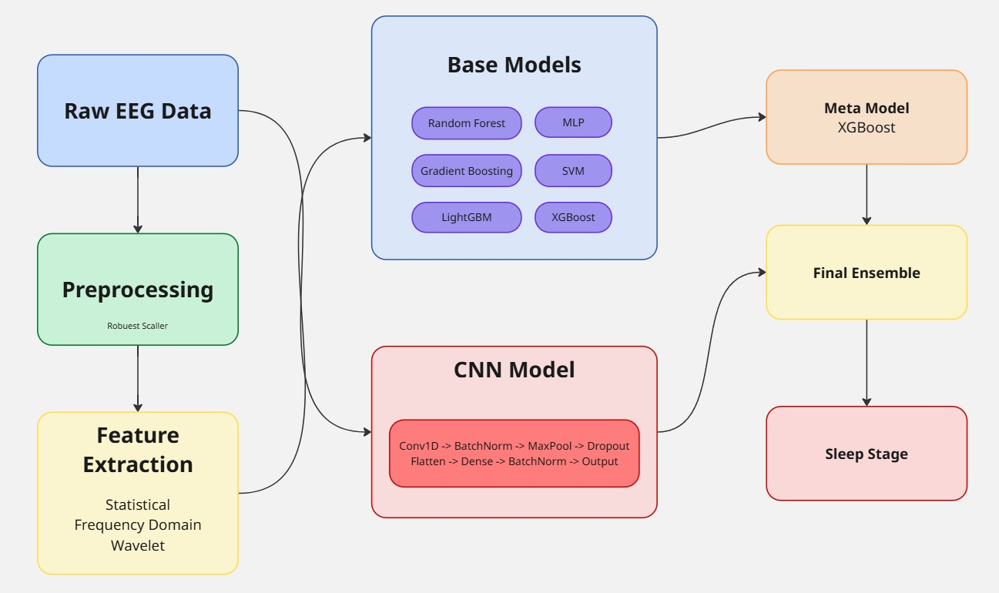

# EEG-Based Sleep Stage Classification

A sophisticated machine learning pipeline for automated sleep stage classification using EEG (electroencephalogram) signals.

## Project Overview

This project implements an ensemble machine learning approach to classify sleep stages from EEG data. The system combines traditional machine learning models with deep learning techniques to achieve high accuracy in sleep stage detection, which is crucial for sleep disorder diagnosis and research.

## Features

- **Comprehensive Feature Extraction**: Statistical, frequency domain, wavelet-based, and Hjorth parameters
- **Ensemble Learning**: Combines multiple models (Random Forest, Gradient Boosting, XGBoost, LightGBM, SVM, MLP)
- **Deep Learning**: 1D Convolutional Neural Network for raw signal processing
- **Stacked Ensemble**: Meta-learner combines predictions from base models
- **Robust Preprocessing**: Signal normalization and feature selection
- **Cross-validation**: Rigorous model evaluation

## Requirements

- Python 3.7+
- TensorFlow 2.x
- NumPy
- Pandas
- Scikit-learn
- XGBoost
- LightGBM
- Matplotlib
- Seaborn
- SciPy
- PyWavelets
- Google Colab (optional, for GPU acceleration)

## Installation

1. Clone this repository:
   ```
   git clone https://github.com/OussamaOuldRouis/eeg-sleep-classification.git
   cd eeg-sleep-classification
   ```

2. Install required packages:
   ```
   pip install -r requirements.txt
   ```

## Data Preparation

The project expects CSV files with the following format:
- First column: Class labels (sleep stages)
- Remaining columns: EEG signal data

Place your data in a directory structure as follows:
```
EEG_Data/
├── train_data.csv
└── test_data.csv
```

## Usage

### Training

```python
from eeg_classification import main

# Run the complete training pipeline
main()
```

This will:
1. Load and preprocess the training data
2. Extract features from the EEG signals
3. Train multiple machine learning models
4. Create a stacked ensemble model
5. Train a CNN model
6. Evaluate the combined model
7. Save all models and results

### Prediction

```python
from eeg_classification import predict

# Generate predictions on new data
predict("test_data.csv", "output_predictions.csv")
```

## How It Works

### Feature Engineering

The system extracts four types of features from EEG signals:

1. **Statistical Features**: Mean, standard deviation, skewness, kurtosis, etc.
2. **Frequency Domain Features**: Power spectral density in delta, theta, alpha, beta, and gamma bands
3. **Wavelet Features**: Multi-level wavelet decomposition coefficients
4. **Hjorth Parameters**: Activity, mobility, and complexity

### Model Architecture



1. **Base Models**: Multiple classifiers trained on extracted features
2. **Meta-Model**: XGBoost classifier trained on base model predictions
3. **CNN Model**: 1D convolutional neural network trained on raw signals
4. **Final Ensemble**: Weighted combination of meta-model and CNN predictions

## Results

The model generates several evaluation outputs:
- Classification report (precision, recall, F1-score)
- Confusion matrix
- Feature importance visualization

Results are saved in the `EEG_Models` directory.

## Customization

You can customize various aspects of the pipeline:

- **Feature Extraction**: Modify the `extract_features` function
- **Model Parameters**: Adjust the hyperparameters in `create_ensemble_models`
- **CNN Architecture**: Modify the `create_cnn_model` function
- **Ensemble Weights**: Change the weights in `final_ensemble_prediction`

## Performance Optimization

To improve performance:
- Use GPU acceleration for training the CNN model
- Adjust batch size based on your hardware capabilities
- Experiment with different feature combinations
- Tune the hyperparameters of the models


## Contact
For questions or feedback, please contact [mohamed.oussama.ould.rouis@ensia.edu.dz](mailto:mohamed.oussama.ould.rouis@ensia.edu.dz)
